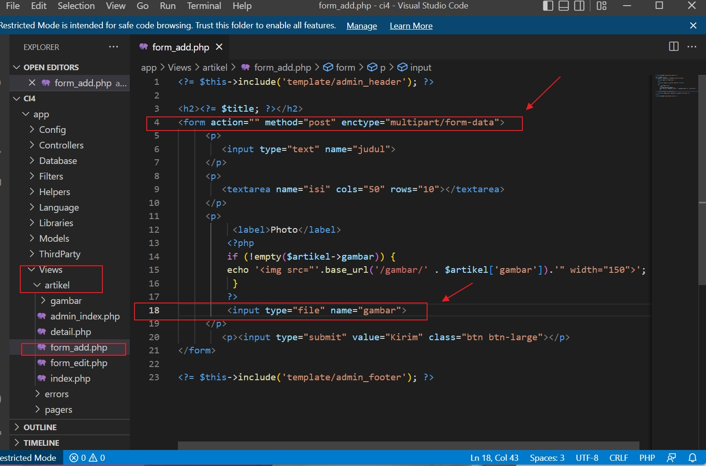

# Pemograman Web2 Pertemuan 12

## Profil
| #               | Biodata                      |
| --------------- | ---------------------------- |
| **Nama**        | M. AKMAL AL ABDILAH          |
| **NIM**         | 312110034                    |
| **Kelas**       | TI.21.A.1                    |
| **Mata Kuliah** | Pemrograman Web 2            |

<p align="center">
 
</p>
<p align="center">
<a href="https://github.com/akmalabdilah"></a>
<p align="center">


<hr>

## Praktikum 10 : Pagination dan Pencarian

<hr>

**Instruksi Praktikum**
1. Persiapkan text editor misalnya **VSCode.**
2. Buka kembali folder dengan nama **lab11_php_ci** pada docroot webserver **(htdocs)**
3. Ikuti langkah-langkah praktikum yang akan dijelaskan berikutnya.<br>
**Langkah-langkah Praktikum**<br>
**Membuat Pagination**<br>
Pagination merupakan proses yang digunakan untuk membatasi tampilan yang panjang
dari data yang banyak pada sebuah website. Fungsi pagination adalah memecah
tampilan menjadi beberapa halaman tergantung banyaknya data yang akan ditampilkan
pada setiap halaman.

Pada Codeigniter 4, fungsi pagination sudah tersedia pada Library sehingga cukup
mudah menggunakannya.
Untuk membuat pagination, buka Kembali **Controller Artikel**, kemudian modifikasi
kode pada method admin_index seperti berikut.
```
public function admin_index()
{
$title = 'Daftar Artikel';
$model = new ArtikelModel();
$data = [
'title' => $title,
'artikel' => $model->paginate(10), #data dibatasi 10 record per
halaman
'pager' => $model->pager,
];
return view('artikel/admin_index', $data);
}
```


Gambar 1. modifikasi
kode pada method admin_index

Kemudian buka file **views/artikel/admin_index.php** dan tambahkan kode berikut
dibawah deklarasi tabel data.
```
<?= $pager->links(); ?>
```


Gambar 2. Pagination_link

Selanjutnya buka kembali menu daftar artikel, tambahkan data lagi untuk melihat
hasilnya.


Gambar 3. Pagination

**Membuat Pencarian**<br>
Pencarian data digunakan untuk memfilter data.<br>
Untuk membuat pencarian data, buka kembali **Controller Artikel**, pada method
**admin_index** ubah kodenya seperti berikut:
```
public function admin_index()
{
$title = 'Daftar Artikel';
$q = $this->request->getVar('q') ?? '';
$model = new ArtikelModel();
$data = [
'title' => $title,
'q' => $q,
'artikel' => $model->like('judul', $q)->paginate(10), # data
dibatasi 10 record per halaman
'pager' => $model->pager,
];
return view('artikel/admin_index', $data);
}
```


Gambar 4. Pagination.admin.index.filter.data

Kemudian buka kembali file **views/artikel/admin_index.php** dan tambahkan form
pencarian sebelum deklarasi tabel seperti berikut:
```
<form method="get" class="form-search">
<input type="text" name="q" value="<?= $q; ?>" placeholder="Cari data">
<input type="submit" value="Cari" class="btn btn-primary">
</form>
```
Dan pada link pager ubah seperti berikut.
```
<?= $pager->only(['q'])->links(); ?>
```


Gambar 5. form_pencarian_admin_index.php

Selanjutnya ujicoba dengan membuka kembali halaman admin artikel, masukkan kata
kunci tertentu pada form pencarian.


Gambar 6. Pencarian Data

**Upload Gambar**<br>
Menambahkan fungsi unggah gambar pada tambah artikel. Buka kembali **Controller**
Artikel, sesuaikan kode pada method **add** seperti berikut:
```
public function add()
{
// validasi data.
$validation = \Config\Services::validation();
$validation->setRules(['judul' => 'required']);
$isDataValid = $validation->withRequest($this->request)->run();
if ($isDataValid)
{
$file = $this->request->getFile('gambar');
$file->move(ROOTPATH . 'public/gambar');
$artikel = new ArtikelModel();
$artikel->insert([
'judul' => $this->request->getPost('judul'),
'isi' => $this->request->getPost('isi'),
'slug' => url_title($this->request->getPost('judul')),
'gambar' => $file->getName(),
]);
return redirect('admin/artikel');
}
$title = "Tambah Artikel";
return view('artikel/form_add', compact('title'));
}
```


Gambar 7. Upload Gambar

Kemudian pada file **views/artikel/form_add.php** tambahkan field input file seperti
berikut.
```
<p>
<input type="file" name="gambar">
</p>
```
Dan sesuaikan tag form dengan menambahkan *ecrypt type* seperti berikut.
```
<form action="" method="post" enctype="multipart/form-data">
```


Gambar 8. add ecrypt type

Ujicoba file upload dengan mengakses menu tambah artikel.


Gambar 9. Upload Gambar

<hr>

# Pertanyaan dan Tugas

<hr>

**Selesaikan programnya sesuai Langkah-langkah yang ada. Anda boleh melakukan
improvisasi>**

>**Jawab:**
 
 **`Tambah Artikel & Upload Gambar`**
 
Saya Buat Artikel Keempat dan mengupload gambar artikel :


Gambar 10. Upload Gambar


Disini saya sudah setting untuk tampilan saya batasi 4 halaman :

Dan Selanjutnya kita buat artikel lagi dan kita buka Navigasi Halaman Ke 2 :


 **`Cari/Filter Artikel`**
 
 saya coba Cari/filter untuk Artikel Kelima :
 
 

 **`Tampilan Artikel Di portal Berita`**
 
  
  
  
  <hr>
  
  Cukup Sekian Penjelasan Dari saya
  
  **SELESAI**
  <hr>

<div>
<h2 align="center">Thanks For Reading!!!</h2>
<div align="center">


